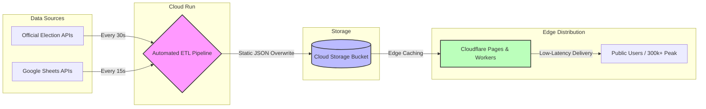

# Case Study: Real-Time National Election Data Pipeline

## 1) Project Background / Overview
In early 2026, the Public Relations Department (PRD) initiated the development of a nationwide real-time reporting platform to communicate official election and referendum results to the public. The primary objective was to establish a centralized, transparent, and highly accessible digital hub where citizens, news media, and stakeholders could follow live updates down to the constituency level.

The platform was required to transform highly complex electoral data into clear, easily digestible visualizations. It needed to seamlessly support national-level summaries, interactive geographical breakdowns across 400 constituencies, and a standalone referendum reporting module within a unified, high-performance system.

The team was responsible for the end-to-end design and development of the platform, including UX/UI design, interactive data visualization, map integration, seat calculations, and overall system optimization. As the **Data Engineer** on this project, I worked closely with the Tech Lead to design the core data architecture and was solely responsible for developing the automated data ingestion and transformation pipelines (ETL) required to sustain massive public traffic under a strict zero-error mandate.

---

## 2) Challenges
This project was exceptionally time-sensitive and carried immense national stakes.
*   **Highly Compressed Timeline:** The team had just over three weeks to design, develop, test, and deploy the entire system from scratch. This forced parallel execution across UI/UX design, API integration, and data architecture stabilization.
*   **Dynamic and Rapid Data Volatility:** Election data fluctuated minute-by-minute. The pipeline had to dynamically reflect these changes with sub-minute latency while aligning perfectly with official calculation rules to eliminate any risk of public misinformation.
*   **Severe Traffic Spike Vulnerability:** The platform had to remain incredibly robust to support nationwide access during peak live announcement hours. Relying on traditional dynamic database queries under a load of **300,000+ concurrent users** would instantly cause connection pool exhaustion and total system failure.

---

## 3) Actions

### 3.1) Data Process & Infrastructure Design
As my primary area of responsibility, the data pipeline and infrastructure were developed through strategic collaboration with the Tech Lead, focusing on high availability and absolute fault tolerance:

*   **API Transformation & Optimization:** I engineered automated ingestion workflows to fetch raw payloads from official source streams and secondary Google Sheets APIs. The raw, deeply nested data was systematically cleaned and transformed into highly optimized, flattened JSON formats structured specifically for frontend efficiency. This allowed the client-side maps and charts to render dynamically without lag.
*   **High-Availability Static Architecture:** To eliminate relational database bottlenecks under extreme user loads, we implemented a static generation approach. Transformed datasets were written directly to Cloud Object Storage buckets (GCS), which served as a high-performance delivery layer. This completely insulated the core application compute from public read volume.
*   **Automated Real-Time Synchronization & Caching:** I deployed stateless orchestration workers running continuous, automated time-triggered loops. To optimize cloud infrastructure bills and edge network overhead, I developed delta-check logic ensuring that **files were only overwritten to object storage when a cryptographic data hash change was detected**. Custom edge caching rules were enforced via CDN layers, tuning cache lifecycles according to volatility (e.g., 15-second cycles for operational control data and 30-second cycles for live voting statistics).

### 3.2) Optimized Storage Architecture & File Layout
To enable sub-second client data delivery and decoupled CDN invalidation paths, I structured the Object Storage layout into strict, predictable namespaces. This allowed our edge workers to route traffic efficiently without scanning the entire storage hierarchy:

```text
my-bucket/
├── assets/
│   ├── images/
│   │   ├── candidates/               # Pre-processed/resized candidate profiles
│   │   └── political-parties/        # Retouched high-performance party logos
│   └── static-data/                  # Static asset lookup configurations
└── live/
    ├── latest.json                   # Current global live score snapshot
    ├── operational-control.json      # Internal operational configuration controls
    └── historical-versions/
        └── {timestamp or version}/   # Incremental structural snapshots for audit
```

### 3.3) Conceptual Data Flow Workflow
Below is the high-level conceptual data flow architecture engineered to bypass computational bottlenecks and deliver optimized static payloads to the edge:



### 3.4) Core Development & Design Support (Overall View)
While focusing primarily on the data layer, I maintained continuous alignment with the rest of the product lifecycle:
*   **Visualization Readiness:** Assisted the frontend team by providing predictable data models tailored for their single-page national summaries, dynamic seat tally bar charts, and constituency smart filters.
*   **Zero-Error Alignment:** Participated in refining data schemas to handle intricate regional parameters and dual-ballot data separations, guaranteeing absolute structural integrity across the system.

### 3.5) QA & Operations
Since this platform was built for a high-concurrency event, our quality assurance protocols were heavily focused on continuous live stream simulations. We ran extensive integration tests to verify that the edge layers refreshed accurately based on incoming data loops, ensuring the data transformation pipelines maintained stable scheduling blocks under synthetic traffic loads.

---

## 4) Result / Impact / Interesting Points
*   **Successful On-Time Launch:** Deployed a highly scalable, nationwide civic technology platform within a heavily compressed three-week window under strict zero-error standards.
*   **Flawless High-Traffic Performance:** Successfully supported over **300,000+ concurrent users** at peak live-broadcasting hours with zero service degradation, latencies, or system disruptions.
*   **Enhanced Data Transparency:** Empowered citizens and newsrooms to seamlessly explore official voting data from national summaries down to granular local districts via an interactive interface.
*   **Proven Agile Engineering:** Demonstrated a robust capability to architect production-grade, highly automated data pipelines and robust infrastructure solutions under critical, high-pressure timelines.
