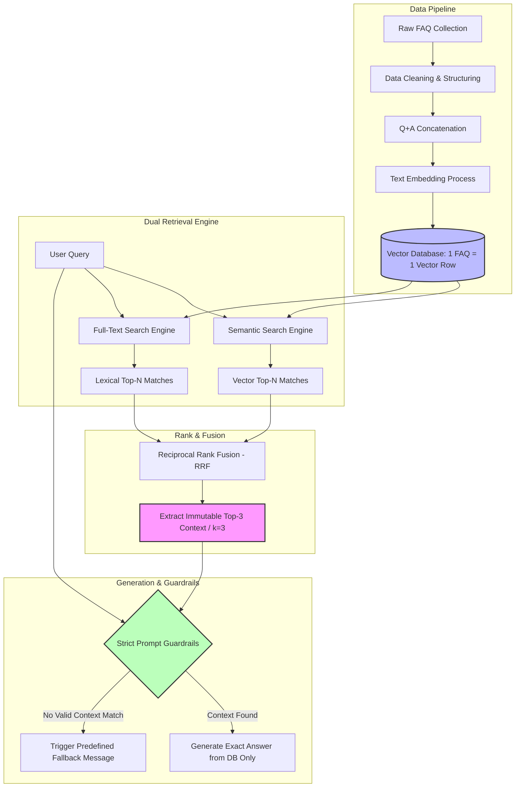

# Case Study: ConForAll AI Chatbot – Production-Grade Structured RAG for Political Referendum FAQ

## 1) Project Background / Overview
During the **ConForAll** campaign for constitutional reform and the 2026 referendum in Thailand, public engagement sparked a massive volume of daily inquiries. These ranged from high-level democratic principles to tactical logistics regarding public participation. 

To address this, we developed an intelligent AI Chatbot deployed directly on [conforall.com](https://conforall.com/) to provide fast, reliable, and 24/7 access to official campaign information. Serving as the **AI / Data Engineer** on this project, I engineered a high-precision, production-grade **Retrieval-Augmented Generation (RAG)** pipeline designed specifically to handle sensitive data without the risk of misinformation.

* 🔗 **Website:** [ConForAll Platform](https://conforall.com/)

---

## 2) Goal & Challenges
* **Strict Accuracy Requirements:** Given the highly sensitive and legally bound nature of political campaigns and constitutional referendums, the chatbot could **never** interpret, assume, or invent answers. 
* **The Pitfalls of Unstructured RAG:** Standard RAG pipelines rely on arbitrary document slicing (fixed-size chunking). This introduces text-boundary issues where questions and their respective answers are split across different chunks. When an LLM tries to piece incomplete context together, it inevitably results in **AI Hallucination**.
* **Linguistic Variance vs. Technical Precision:** Public queries often rely on indirect, conversational phrasing (requiring semantic understanding), yet they frequently demand exact keyword matches for specific legal articles, voter statistics, or dates (requiring lexical precision).

---

## 3) Actions & Architectural Decisions

### 3.1) Data Engineering: Transitioning from Unstructured to Structured RAG
Instead of splitting long campaign documents into arbitrary chunks, I re-architected the data pipeline into a **Structured RAG** framework utilizing a strict **"1 FAQ = 1 Vector Row"** data topography.

* **Q+A Concatenation:** Each row in the vector database stores a fully formed, concatenated string containing both the explicit question and its official answer (e.g., `“Q: When will the constitutional referendum happen? A: The referendum will take place at the same time as...”`).
* **Eliminating Boundary Risks:** This guarantees that whenever the retrieval engine hits a match, it pulls a single, hermetically sealed unit of context. There is zero risk of capturing half-severed sentences, ensuring the LLM receives complete context every time.
* **The Trade-off:** This architectural choice requires meticulous up-front data preparation. I established rigorous data cleaning workflows to ensure the source FAQ base was pristine, as any ambiguity in the source Q&A structural alignment would directly degrade vector representation quality.

### 3.2) Retrieval Mechanics: Hybrid Search & RRF Tuning ($k=3$)
To balance semantic intent with rigid keyword execution, I implemented a dual-engine retrieval framework combined with advanced rank merging:

* **Semantic Search:** Resolves diverse user phrasings and conceptual queries by computing vector similarities.
* **Full-Text Search (Lexical):** Executes exact token matching to capture strict numbers, legal terminology, and critical campaign dates with 100% precision.
* **Reciprocal Rank Fusion (RRF) & Why $k=3$:** Rather than fetching just the single top match ($k=1$), the outputs from the Semantic and Lexical engines are synthesized via RRF, and the **Top 3 ($k=3$)** rows are extracted. This decision was driven by two production realities:
  1. Real-world users frequently ask compound questions that wrap multiple distinct concerns into a single query block.
  2. Passing the top 3 contextual components grants the LLM sufficient scope to extract the most comprehensive answer, bypassing the rigid limitations of a single-vector look-up.

### 3.3) System Architecture Workflow
The complete data lifecycle, from ingestion to secure dynamic generation, is mapped out below:

### 3.4) Strict Prompt Engineering Guardrails
To enforce absolute grounding, I designed a Strict Context Constraint prompt topology. The large language model is operating as a closed-book extractor:

* The system is explicitly forbidden from accessing its internal pre-trained weights or external knowledge bases.
* The LLM is prohibited from extrapolating, summarizing across unverified facts, or synthesizing adjacent arguments.
* If the retrieved $k=3$ context blocks fail to contain a direct answer to the query, the engine intercepts the execution path and outputs an unalterable, pre-configured fallback notice rather than attempting to guess.

---

## 4) Results / Impact / Key Takeaways
* **Zero Hallucination in Production:** By binding the system to a structured database format (1 FAQ = 1 Vector Row) paired with rigorous context restrictions, the chatbot delivered flawless accuracy without a single instance of political misinformation or hallucinated claims.
* **Substantial Administrative Relief:** Providing accurate, instantaneous 24/7 coverage deflected the vast majority of routine logistical inquiries, allowing campaign administrators to focus exclusively on highly edge-case or non-FAQ community issues.
* **Data-Driven Campaign Insights:** The real-time aggregation of conversational analytics provided the core campaign team with direct visibility into primary public anxieties and interests, allowing them to rapidly refine their broader physical and digital communication strategies.
* **Core Engineering Metric:** Proved that for high-stakes, politically sensitive environments, data structure optimization and retrieval constraint parameters are significantly more critical to system safety than general LLM generative capacity.

