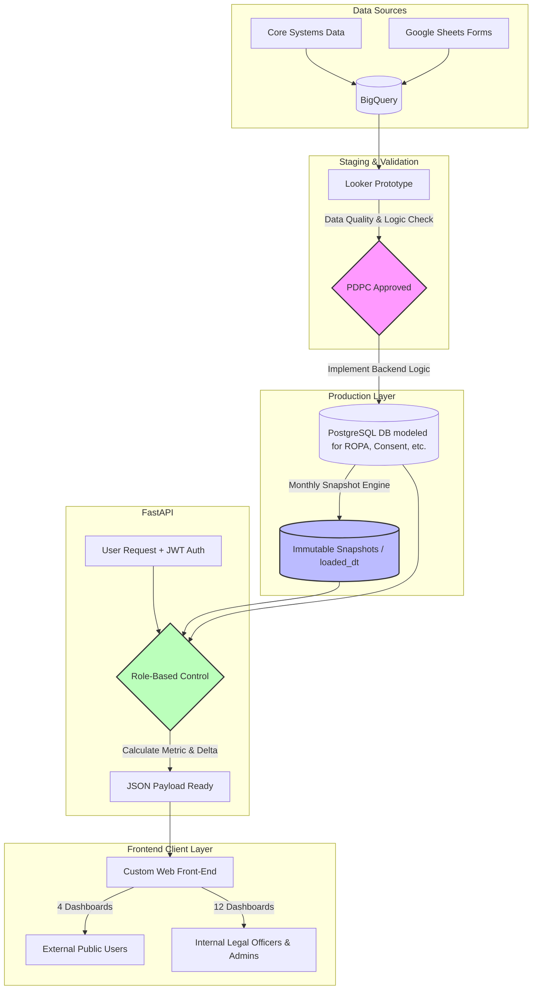

# Case Study: Custom Government Privacy Compliance Dashboard (GPPC)

## 1) Project Background / Overview
**GPPC (Government Privacy Compliance)** is a national platform under the **Office of the Personal Data Protection Commission (PDPC)** in Thailand. The system is designed to enable public sector agencies to manage, monitor, and adhere to Personal Data Protection Act (PDPA) compliance standards efficiently.

This project focused on modernizing and migrating the reporting ecosystem from a legacy **Looker** infrastructure to a fully customized **Web Application**. This transition unlocked fine-grained access control, highly flexible layout mechanics, and an optimized user experience tailored specifically to Thai government requirements. Developed under the primary vendor **ATT**, I served as the **Data Modeler & Backend Engineer** responsible for designing the database schemas to support data storage across multiple statutory compliance modules, establishing time-series snapshot engines, implementing dynamic multi-tier aggregation logic, and configuring granular endpoint access controls.

* 🔗 **Website:** [GPPC Dashboard Platform](https://gppc-dashboard.pdpc.or.th/dashboard/home)

---

## 2) Challenges
* **Intricate Government Hierarchy:** Data structures within the platform are split into Ministry and Department tiers. The backend engine needed to support dynamic granularity toggling and complex hierarchical filtering without causing query performance degradation.
* **Data Drift & Upstream Mutation:** Raw data ingested from Core Systems and manual Google Sheets forms was highly volatile. Upstream modifications or manual updates by administrators risked altering historical records, creating inconsistencies in historical reporting.
* **Legacy BI Constraints:** The original Looker setup imposed severe limitations on visual layout flexibility and granular access controls, which restricted the front-end team from delivering an optimal user experience tailored to government specifications.

---

## 3) Actions

### 3.1) Database Design & Infrastructure
* **Module-Based Database Modeling:** As the Data Modeler, I designed and structured the production database schema to effectively store and manage data tailored to specific regulatory compliance modules, including ROPA, Consent Management, DSAR, Data Breach Tracking, Privacy Notice & Cookie Banner, Data Flow Automation, and ROI reporting.
* **Looker to BigQuery Validation Path:** During the initialization phase, I collaborated with the Design Lead to construct a rapid-prototype environment mapping BigQuery pipelines directly into Looker. This served as a live staging sandbox allowing executive PDPC stakeholders to audit data quality and sign off on calculation metrics before the business logic was hard-coded into production-ready REST endpoints.
* **Immutable Time-Series Snapshot Engine:** To eliminate data drift, I designed a snapshot system within the PostgreSQL layer. The pipeline executes a monthly snapshot at exactly midnight on the final day of each calendar month. By locking queries against a permanent `loaded_dt` (Snapshot Date) field, the database permanently secures historical compliance reporting from retrospective modifications.
* **Dynamic Aggregation & Delta Engine:** I developed a dynamic filtering framework in FastAPI to evaluate statistics on the fly. The engine automatically fetches target monthly snapshots alongside their preceding temporal counterparts, calculates the mathematical differentials (`change`), and streams the data to the front-end to populate UI trend indicators (e.g., directional flags), while supporting alignments with the official government fiscal cycle.

### 3.2) Access Separation Architecture
I engineered a strict role-based access control layer verified via **JWT Authentication** to isolate analytical screens based on two user permissions:
* **External Target (Public Sector):** Provides access to 4 core high-level overview dashboards, including System Usage Overview, User Satisfaction Summaries, and Knowledge/Training Progress.
* **Internal Target (Legal Officers & PDPA Administrators):** Grants access to a full suite of 12 analytical dashboards mapped to statutory PDPA operations (including ROPA & Gap Analysis, Consent Management, DSAR, Data Breach Tracking, Privacy Notice & Cookie Banner, Data Flow Automation, and Economic Valuation ROI).

### 3.3) Conceptual Data Flow Workflow
Below is the architectural flow illustrating data ingestion, validation prototyping, snapshot persistence, and role-based delivery:

### 3.4) Core Development & Design Support
* **UI Component Empowerment:** Designed and served highly optimized JSON schemas from the backend. This decoupled execution allowed the front-end team to bypass previous Looker layout limitations and implement advanced custom UI components, such as horizontal matrix scrolling, custom mouse-hover tooltips (i), dynamic legend toggling, and interactive server-side pagination or sorting.

### 3.5) QA & Operations
* **Airtight Security Validation:** Focused testing protocols heavily around JWT payload verification to ensure multi-tenant security filters at the Ministry and Department levels were fully secure. This successfully blocked potential cross-departmental leaks of highly sensitive data assets, such as internal Data Breach counts and legal Gap Analysis scores.

---

## 4) Result / Impact / Interesting Points
* **Successful Legacy Migration:** Successfully migrated the entire analytical reporting layer away from Looker frames into a high-performance custom application architecture tailored to structural requirements.
* **Data Integrity Secured:** The time-series snapshot engine successfully prevented data drift, guaranteeing that historical reporting timelines remain 100% stable and structurally unalterable.
* **Highly Optimized Performance:** Shifting dynamic analytical workloads into backend PostgreSQL aggregation structures minimized database processing overhead and drastically reduced page-loading latencies.
* **Robust Access Security:** Embedded JWT verification rules at the individual API endpoint level provided robust segregation of duties, ensuring sensitive compliance workflows are completely isolated by user privileges.
